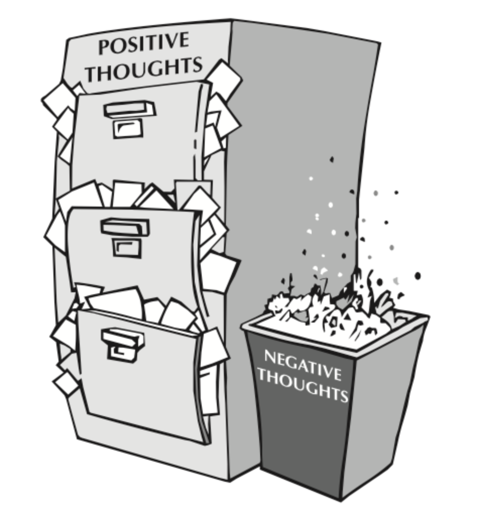

## Simple image



```json
{
  "components": [{
    "src": "/lesson-assets/14000/images/positive-thoughts.png",
    "type": "image",
    "classes": [{
        "name": "pa-generated-class-iujua",
        "type": 1,
        "label": "pa-generated-class-iujua"
    }],
    "content": "",
    "attributes": {
        "src": "/lesson-assets/14000/images/positive-thoughts.png",
        "data-pa-generated-class": "pa-generated-class-iujua"
    }
  }]
}
```
