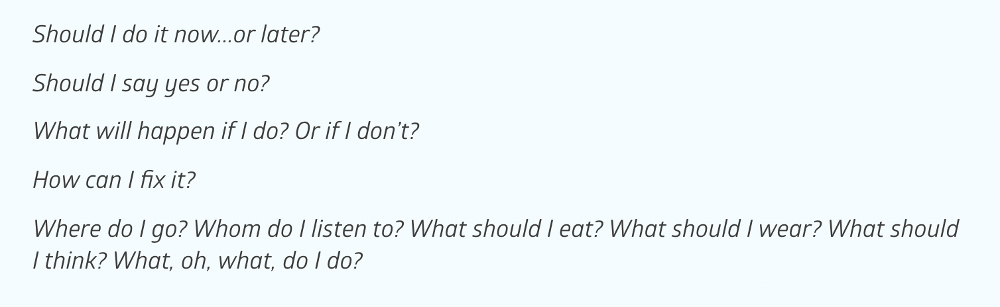

Wrapper components are a set of containers that behave like a wrapper for different elements.

## Narrative
A wrapper which contains a set of paragraphs. Usually it describes a narrative area from the lesson.



```json
{
  "components": [{
        "type": "narrative",
        "content": "",
        "tagName": "div",
        "components": [{
            "type": "text",
            "classes": [{
                "name": "pa-paragraph",
                "type": 1,
                "label": "pa-paragraph"
            }],
            "content": "Should I do it now...or later?"
        }, {
            "type": "text",
            "classes": [{
                "name": "pa-paragraph",
                "type": 1,
                "label": "pa-paragraph"
            }],
            "content": "Should I say yes or no?"
        }, {
            "type": "text",
            "classes": [{
                "name": "pa-paragraph",
                "type": 1,
                "label": "pa-paragraph"
            }],
            "content": "What will happen if I do? Or if I don’t?"
        }, {
            "type": "text",
            "classes": [{
                "name": "pa-paragraph",
                "type": 1,
                "label": "pa-paragraph"
            }],
            "content": "How can I fix it?"
        }, {
            "type": "text",
            "classes": [{
                "name": "pa-paragraph",
                "type": 1,
                "label": "pa-paragraph"
            }],
            "content": "Where do I go? Whom do I listen to? What should I eat? What should I wear? What should I think? What, oh, what, do I do?"
        }]
    }]
}
```
