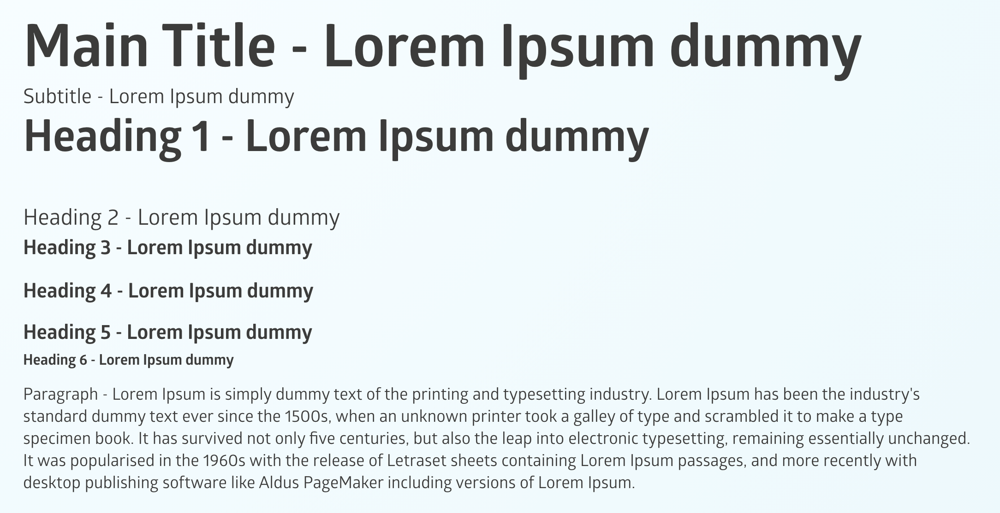

## Textnode

```json
{
   "type": "textnode",
   "content": "Lorem ipsum dolor sit amet"
}
```

## Text

### Text with bold


```json

   {
      "type":"text",
      "classes":[
         {
            "name":"pa-generated-class-in97",
            "type":1,
            "label":"pa-generated-class-in97"
         }
      ],
      "content":"",
      "attributes":{
         "id":"in97"
      },
      "components":[
         {
            "type":"textnode",
            "classes":[
               {
                  "name":"pa-generated-class-iu8c",
                  "type":1,
                  "label":"pa-generated-class-iu8c"
               }
            ],
            "content":"Lorem ",
            "tagName":""
         },
         {
            "type":"text",
            "classes":[
               {
                  "name":"pa-generated-class-ise3",
                  "type":1,
                  "label":"pa-generated-class-ise3"
               }
            ],
            "content":"Ipsum",
            "tagName":"b"
         },
         {
            "type":"textnode",
            "classes":[
               {
                  "name":"pa-generated-class-izel",
                  "type":1,
                  "label":"pa-generated-class-izel"
               }
            ],
            "content":" is simply dummy text ",
            "tagName":""
         }
      ]
   }

```


### Text with other decorations


```json

   {
      "type":"text",
      "classes":[
         {
            "name":"pa-generated-class-ixjv",
            "type":1,
            "label":"pa-generated-class-ixjv"
         }
      ],
      "content":"",
      "attributes":{
         "id":"ixjv"
      },
      "components":[
         {
            "type":"textnode",
            "classes":[
               {
                  "name":"pa-generated-class-iecn",
                  "type":1,
                  "label":"pa-generated-class-iecn"
               }
            ],
            "content":"Lorem ",
            "tagName":""
         },
         {
            "type":"text",
            "classes":[
               {
                  "name":"pa-generated-class-i8d7",
                  "type":1,
                  "label":"pa-generated-class-i8d7"
               }
            ],
            "content":"Ipsum",
            "tagName":"b"
         },
         {
            "type":"textnode",
            "classes":[
               {
                  "name":"pa-generated-class-ib1z",
                  "type":1,
                  "label":"pa-generated-class-ib1z"
               }
            ],
            "content":" is simply ",
            "tagName":""
         },
         {
            "type":"text",
            "classes":[
               {
                  "name":"pa-generated-class-iiav",
                  "type":1,
                  "label":"pa-generated-class-iiav"
               }
            ],
            "content":"dummy",
            "tagName":"i"
         },
         {
            "type":"textnode",
            "classes":[
               {
                  "name":"pa-generated-class-i8gy",
                  "type":1,
                  "label":"pa-generated-class-i8gy"
               }
            ],
            "content":" text of ",
            "tagName":"",
            "highlightable":0
         },
         {
            "type":"text",
            "classes":[
               {
                  "name":"pa-generated-class-i5ai",
                  "type":1,
                  "label":"pa-generated-class-i5ai"
               }
            ],
            "content":"the",
            "tagName":"u"
         },
         {
            "type":"textnode",
            "classes":[
               {
                  "name":"pa-generated-class-itog",
                  "type":1,
                  "label":"pa-generated-class-itog"
               }
            ],
            "content":" printing and ",
            "tagName":""
         },
         {
            "type":"text",
            "classes":[
               {
                  "name":"pa-generated-class-ifwwe",
                  "type":1,
                  "label":"pa-generated-class-ifwwe"
               }
            ],
            "content":"typesetting",
            "tagName":"s"
         },
         {
            "type":"textnode",
            "classes":[
               {
                  "name":"pa-generated-class-izsq9",
                  "type":1,
                  "label":"pa-generated-class-izsq9"
               }
            ],
            "content":" industry.",
            "tagName":""
         }
      ]
   }

```

### Decoration wrapper


```json
{
   "type":"text",
   "classes":[
      {
         "name":"pa-generated-class-i18b",
         "type":1,
         "label":"pa-generated-class-i18b"
      }
   ],
   "content":"",
   "attributes":{
      "id":"i18b"
   },
   "components":[
      {
         "type":"textnode",
         "classes":[
            {
               "name":"pa-generated-class-itny",
               "type":1,
               "label":"pa-generated-class-itny"
            }
         ],
         "content":"Lorem Ipsum is simply ",
         "tagName":""
      },
      {
         "type":"text",
         "classes":[
            {
               "name":"pa-generated-class-iu4f",
               "type":1,
               "label":"pa-generated-class-iu4f"
            }
         ],
         "content":"",
         "tagName":"b",
         "components":[
            {
               "type":"text",
               "classes":[
                  {
                     "name":"pa-generated-class-i2ud",
                     "type":1,
                     "label":"pa-generated-class-i2ud"
                  }
               ],
               "content":"dummy",
               "tagName":"i"
            }
         ]
      },
      {
         "type":"textnode",
         "classes":[
            {
               "name":"pa-generated-class-ij88",
               "type":1,
               "label":"pa-generated-class-ij88"
            }
         ],
         "content":" text ",
         "tagName":""
      }
   ]
}
```

## Text Styles

**Text styles** are _text_ components that have a specific HTML tag used to determine the different styles available in
a lesson.

Positive Action is currently providing the following **text styles**:
- Main Title
- Subtitle
- Heading 1, Heading 2, Heading 3, Heading 4, Heading 5, Heading 6
- Paragraph


As you'll have already experienced in your work with _text_ components, the structure will define a "tagName"
which in this case can be h1, h2, h3, h4, h5, h6, div, span or p (paragraph) and the content will be wrapped in it.

Let's take as an example **Heading 1** component structure:


```json

{
   	"components": [{
   		"name": "Heading1",
   		"type": "text",
   		"classes": [{
   			"name": "pa-generated-class-ivofk",
   			"type": 1,
   			"label": "pa-generated-class-ivofk"
   		}],
   		"content": "",
   		"tagName": "h1",
   		"components": [{
   			"type": "textnode",
   			"classes": [{
   				"name": "pa-generated-class-iuybx",
   				"type": 1,
   				"label": "pa-generated-class-iuybx"
   			}],
   			"content": "Heading 1 - Lorem Ipsum dummy",
   			"tagName": ""
   		}]
   	}]
}

```


- "name": "Heading1" - _name_ attribute which can be useful as a general identifier of the element
or when you want to style the element to fit the design of your platform.
- "type" : "text" - _type_ of the element
- "classes" - if Positive Action is providing custom style that needs to be matched, it will be provided here
- "tagName" - h1 in this case as the tag of the element
- "components"
    - "type":"textnode"
    - "content":"Heading 1 - Lorem Ipsum dummy"
    
**Unit Heading**

Here is an example for Unit Heading where we are using Heading 5 component to define it:


```json
   {
   	"components": [{
		"name": "Heading5",
		"type": "text",
		"classes": [{
			"name": "pa-generated-class-iq86yl",
			"type": 1,
			"label": "pa-generated-class-iq86yl"
		}],
		"content": "",
		"tagName": "h5",
		"components": [{
			"type": "textnode",
			"classes": [{
				"name": "pa-generated-class-i5p0vh",
				"type": 1,
				"label": "pa-generated-class-i5p0vh"
			}],
			"content": "UNIT 2",
			"tagName": ""
		}]
	}]
}
```
 
The following screenshot shows a visual representation of the text styles used in the Positive Action lessons. 
While some of them have the same font-size, they differ by adding or removing spacing above or below the element:



Looking at the code for the sample above, we will get the following:

```json
   {
   	"components": [{
   		"name": "MainTitle",
   		"type": "text",
   		"classes": [{
   			"name": "pa-generated-class-inmo4",
   			"type": 1,
   			"label": "pa-generated-class-inmo4"
   		}],
   		"content": "",
   		"components": [{
   			"type": "textnode",
   			"classes": [{
   				"name": "pa-generated-class-iwevk",
   				"type": 1,
   				"label": "pa-generated-class-iwevk"
   			}],
   			"content": "Main Title - Lorem Ipsum dummy",
   			"tagName": ""
   		}]
   	}, {
   		"name": "Subtitle",
   		"type": "text",
   		"classes": [{
   			"name": "pa-generated-class-iuy3i",
   			"type": 1,
   			"label": "pa-generated-class-iuy3i"
   		}],
   		"content": "",
   		"components": [{
   			"type": "textnode",
   			"classes": [{
   				"name": "pa-generated-class-ipv0g",
   				"type": 1,
   				"label": "pa-generated-class-ipv0g"
   			}],
   			"content": "Subtitle - Lorem Ipsum dummy",
   			"tagName": ""
   		}]
   	}, {
   		"name": "Heading1",
   		"type": "text",
   		"classes": [{
   			"name": "pa-generated-class-ivofk",
   			"type": 1,
   			"label": "pa-generated-class-ivofk"
   		}],
   		"content": "",
   		"tagName": "h1",
   		"components": [{
   			"type": "textnode",
   			"classes": [{
   				"name": "pa-generated-class-iuybx",
   				"type": 1,
   				"label": "pa-generated-class-iuybx"
   			}],
   			"content": "Heading 1 - Lorem Ipsum dummy",
   			"tagName": ""
   		}]
   	}, {
   		"name": "Heading2",
   		"type": "text",
   		"classes": [{
   			"name": "pa-biggertext",
   			"type": 1,
   			"label": "pa-biggertext"
   		}, {
   			"name": "pa-generated-class-ilet4",
   			"type": 1,
   			"label": "pa-generated-class-ilet4"
   		}],
   		"content": "",
   		"tagName": "h2",
   		"components": [{
   			"type": "textnode",
   			"classes": [{
   				"name": "pa-generated-class-is667",
   				"type": 1,
   				"label": "pa-generated-class-is667"
   			}],
   			"content": "Heading 2 - Lorem Ipsum dummy",
   			"tagName": ""
   		}]
   	}, {
   		"name": "Heading3",
   		"type": "text",
   		"classes": [{
   			"name": "pa-generated-class-ine5b",
   			"type": 1,
   			"label": "pa-generated-class-ine5b"
   		}],
   		"content": "",
   		"tagName": "h3",
   		"components": [{
   			"type": "textnode",
   			"classes": [{
   				"name": "pa-generated-class-i9wrg",
   				"type": 1,
   				"label": "pa-generated-class-i9wrg"
   			}],
   			"content": "Heading 3 - Lorem Ipsum dummy",
   			"tagName": ""
   		}]
   	}, {
   		"name": "Heading4",
   		"type": "text",
   		"classes": [{
   			"name": "pa-generated-class-iwrqt",
   			"type": 1,
   			"label": "pa-generated-class-iwrqt"
   		}],
   		"content": "",
   		"tagName": "h4",
   		"components": [{
   			"type": "textnode",
   			"classes": [{
   				"name": "pa-generated-class-iywm1",
   				"type": 1,
   				"label": "pa-generated-class-iywm1"
   			}],
   			"content": "Heading 4 - Lorem Ipsum dummy",
   			"tagName": ""
   		}]
   	}, {
   		"name": "Heading5",
   		"type": "text",
   		"classes": [{
   			"name": "pa-generated-class-i858a",
   			"type": 1,
   			"label": "pa-generated-class-i858a"
   		}],
   		"content": "",
   		"tagName": "h5",
   		"components": [{
   			"type": "textnode",
   			"classes": [{
   				"name": "pa-generated-class-iycrj",
   				"type": 1,
   				"label": "pa-generated-class-iycrj"
   			}],
   			"content": "Heading 5 - Lorem Ipsum dummy",
   			"tagName": ""
   		}]
   	}, {
   		"name": "Heading6",
   		"type": "text",
   		"classes": [{
   			"name": "pa-generated-class-i9swg",
   			"type": 1,
   			"label": "pa-generated-class-i9swg"
   		}],
   		"content": "",
   		"tagName": "h6",
   		"components": [{
   			"type": "textnode",
   			"classes": [{
   				"name": "pa-generated-class-ii3wh",
   				"type": 1,
   				"label": "pa-generated-class-ii3wh"
   			}],
   			"content": "Heading 6 - Lorem Ipsum dummy",
   			"tagName": ""
   		}]
   	}, {
   		"name": "Paragraph",
   		"type": "text",
   		"classes": [{
   			"name": "pa-generated-class-it10k",
   			"type": 1,
   			"label": "pa-generated-class-it10k"
   		}],
   		"content": "",
   		"tagName": "p",
   		"components": [{
   			"type": "textnode",
   			"classes": [{
   				"name": "pa-generated-class-iz22l",
   				"type": 1,
   				"label": "pa-generated-class-iz22l"
   			}],
   			"content": "Paragraph - Lorem Ipsum is simply dummy text of the printing and typesetting industry. Lorem Ipsum has been the industry's standard dummy text ever since the 1500s, when an unknown printer took a galley of type and scrambled it to make a type specimen book. It has survived not only five centuries, but also the leap into electronic typesetting, remaining essentially unchanged. It was popularised in the 1960s with the release of Letraset sheets containing Lorem Ipsum passages, and more recently with desktop publishing software like Aldus PageMaker including versions of Lorem Ipsum.",
   			"tagName": ""
   		}]
   	}]
   }
```
