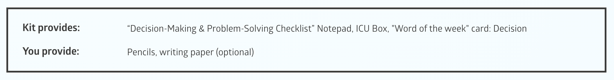

Wrapper components are a set of containers that behave like a wrapper for different elements.

## Narrative
A wrapper which contains a set of paragraphs. Usually it describes a narrative area from the lesson.


```json
{
  "components": [{
        "type": "narrative",
        "content": "",
        "tagName": "div",
        "components": [{
            "type": "text",
            "classes": [{
                "name": "pa-paragraph",
                "type": 1,
                "label": "pa-paragraph"
            }],
            "content": "Should I do it now...or later?"
        }, {
            "type": "text",
            "classes": [{
                "name": "pa-paragraph",
                "type": 1,
                "label": "pa-paragraph"
            }],
            "content": "Should I say yes or no?"
        }, {
            "type": "text",
            "classes": [{
                "name": "pa-paragraph",
                "type": 1,
                "label": "pa-paragraph"
            }],
            "content": "What will happen if I do? Or if I don’t?"
        }, {
            "type": "text",
            "classes": [{
                "name": "pa-paragraph",
                "type": 1,
                "label": "pa-paragraph"
            }],
            "content": "How can I fix it?"
        }, {
            "type": "text",
            "classes": [{
                "name": "pa-paragraph",
                "type": 1,
                "label": "pa-paragraph"
            }],
            "content": "Where do I go? Whom do I listen to? What should I eat? What should I wear? What should I think? What, oh, what, do I do?"
        }]
    }]
}
```

## List item

A list item is composed from a wrapper with two containers, where the left one represents either a bullet or a heading
text while the right one holds the content: 


```json
{
"components": [{
		"type": "listItem",
		"classes": [{
			"name": "pa-listitem",
			"type": 1,
			"label": "pa-listitem"
		}],
		"content": "",
		"components": [{
			"type": "text",
			"classes": [{
				"name": "pa-boldsubtitle",
				"type": 1,
				"label": "pa-boldsubtitle"
			}],
			"content": "Goal"
		}, {
			"type": "text",
			"classes": [{
				"name": "pa-boldtext",
				"type": 1,
				"label": "pa-boldtext"
			}],
			"content": "To learn that the intellectual positive actions of making decisions and solving problems in positive ways help us feel good about ourselves."
		}]
    }]
}
```

## Box

Box wrapper usually contains a List Item component with its child components. The **Box** container has a visual
representation of a thick border all around. 



```json
{
  "components": [{
		"type": "box",
		"classes": [{
			"name": "pa-box",
			"type": 1,
			"label": "pa-box"
		}],
		"content": "",
		"tagName": "div",
		"attributes": {},
		"components": [{
			"type": "listItem",
			"classes": [{
				"name": "pa-listitem",
				"type": 1,
				"label": "pa-listitem"
			}],
			"content": "",
			"components": [{
				"type": "text",
				"classes": [{
					"name": "pa-boldsubtitle",
					"type": 1,
					"label": "pa-boldsubtitle"
				}],
				"content": "Kit provides:"
			}, {
				"type": "text",
				"classes": [{
					"name": "pa-text",
					"type": 1,
					"label": "pa-text"
				}],
				"content": "“Decision-Making & Problem-Solving Checklist” Notepad, ICU Box, \"Word of the week\" card: Decision"
			}]
		}, {
			"type": "listItem",
			"classes": [{
				"name": "pa-listitem",
				"type": 1,
				"label": "pa-listitem"
			}],
			"content": "",
			"components": [{
				"type": "text",
				"classes": [{
					"name": "pa-boldsubtitle",
					"type": 1,
					"label": "pa-boldsubtitle"
				}],
				"content": "You provide:"
			}, {
				"type": "text",
				"classes": [{
					"name": "pa-text",
					"type": 1,
					"label": "pa-text"
				}],
				"content": "Pencils, writing paper (optional)"
			}]
		}]
    }]
}
```
